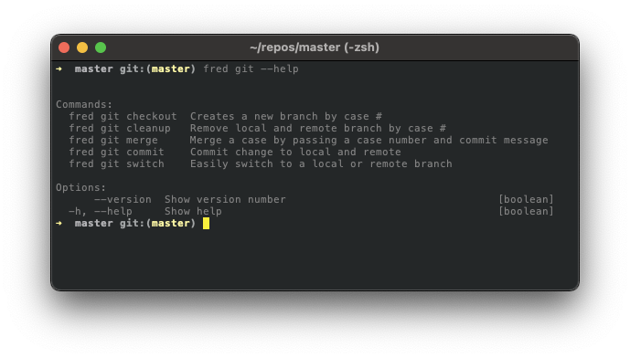

# FRED CLI - `GIT` 


## Usage

```
Options:
  --help, -h 
```

## Example

```sh
fred git
```



## Available Commands

- [Checkout](./checkout/README.md)
- [Cleanup](./cleanup/README.md)
- [Commit](./commit/README.md)
- [Merge](./merge/README.md)
- [Switch](./switch/README.md)

[Back](../README.md) to fred documentation.


