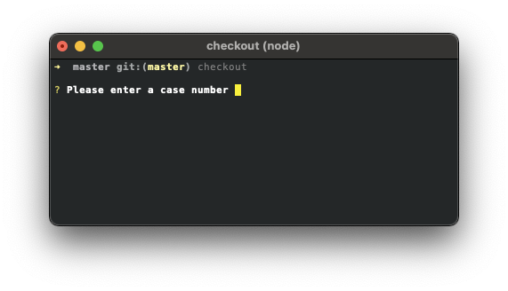

## Checkout

Checkout out a new branch while reducing a few common GIT commands into one simple one.


### Usage

```
Options:
      --version     Show version number                                [boolean]
  -h, --help        Show help                                          [boolean]
  -v, --verbose     Run with verbose logging                           [boolean]
  -c, --casenumber  Case number                                         [number]
```

### Example

```sh
fred git checkout -c 1234
```

### Additional info

Checkout runs the following commands:

1. `git switch master`
2. `git pull`
3. `git checkout -b users/{username}/fb-{casenumber}`
4. `git push -u origin users/{username}/fb-{casenumber}`

If the branch you're on requires a username for naming, you will be prompted for one the first time you run the command. The username will be saved for future use and you will not be prompted again.

If you do not provide the -c option followed by a case number, you will be prompted for one.



[Back](../README.md) to fred git documentation. 