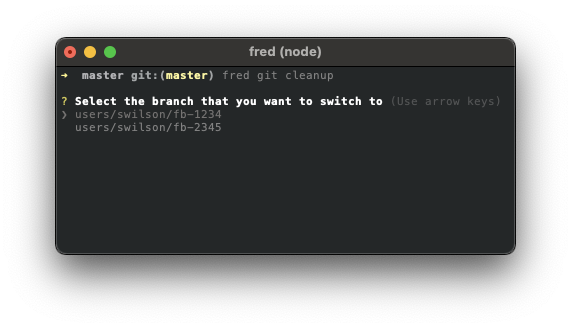

## Cleanup

The cleanup command condenses a few common GIT commands into a single command.  

This cleanup command handles the following for you:

1. `git switch master`
2. `git branch -D ${branchName}`
3. `git push -d origin ${branchName}`

If you do not provide the -c option followed by a case number, you will be provided a list of local branches to select. Use your up/down arrows to select the correct branch and hit enter to run the cleanup.



### Usage

```
Options:
      --version     Show version number                                [boolean]
  -h, --help        Show help                                          [boolean]
  -v, --verbose     Run with verbose logging                           [boolean]
  -c, --casenumber  Case number                                         [number]
```

### Example

```sh
fred git cleanup -c 1234
```