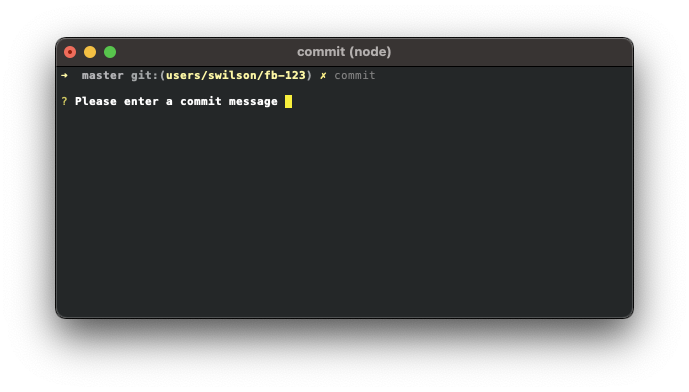
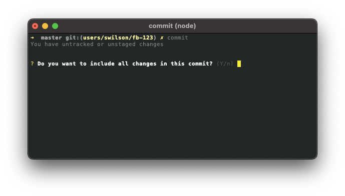

## Commit

The commit command reduces a few common GIT commands into a single command.  

### Usage

```
Options:
      --version     Show version number                                [boolean]
  -h, --help        Show help                                          [boolean]
  -v, --verbose     Run with verbose logging                           [boolean]
  -m, --message     Commit Message                                      [string]
```

### Example

```sh
fred git commit -m "My First Commit Message"
```

### Addition info

This commit command runs the following:

1. `git commit -m "${commitMessage}"`
2. `git push`

If you do not provide the -m option followed by a message, you will be prompted for a message.



If you have unstaged changes, it will ask you if you would like to include those changes in the commit.  In this case, `git add .` runs before the other commands if "y" is entered.  Only currently staged files get committed when "n" is entered.



[Back](../README.md) to fred git documentation.