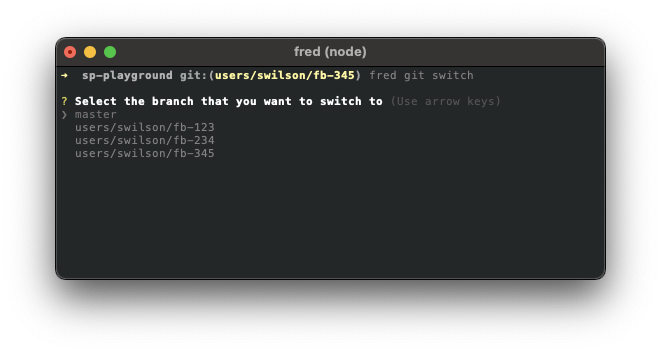

## Switch

Switch to available local and remote branches.

### Usage

```
Options:
      --version     Show version number                                [boolean]
  -h, --help        Show help                                          [boolean]
  -v, --verbose     Run with verbose logging                           [boolean]
  -c, --casenumber  Case number                                         [number]
```

### Example

```sh
fred git switch -c 1234
```

### Additional Info

If you do not provide the -c option, you will be provided a list to select from. Use your up/down arrows to select the correct branch and hit enter to run the switch.



[Back](../README.md) to fred git documentation.